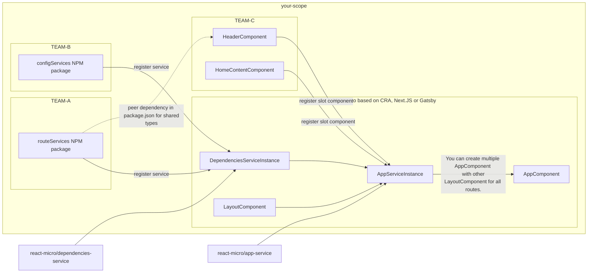

# React micro

The `react-micro` is a collection of packages for create micro frontend environment.

`react-micro` base on `Rect` framework but you can use this packages for micro frontend based on others frameworks

The main advantages of the solution are framework agnostic, type-safe and deploy as monolith.

## Advantages

### Framework agnostic

You can use `react-micro` for create site base on CRA, Gatsby or Next.JS. Some packages support react native too.

### Type safe

All packages check types very strong and required that from your Components and Services.

## Architectures
### Deploy as monolith

Unfortunately we required centralize build and deploy as monolith.
That approach in some cases is positive.
Thanks for that we can better manage types and versions.

## Connections

## Responsibilities

In this section, we will talk about the graph above. The biggest scope is `your-main-repo`. Main repo is responsible for the building app, check all types in project and check versions by NPM peer dependency system.
### DependenciesServiceInstance

We can create this by `react-micro/dependencies-service`. This services controls Services class, functions or static data like object as dependencies.
You can use this service for cache values or split services class to separate them for better encapsulation.

### AppServiceInstance
This service manages components and pass then specific dependencies form `react-micro/dependencies-service`.

### LayoutComponent

It is a small component with skeleton of site. Layout receives in props many components. All the components not require any props. The components are connected directly to dependencies by  `react-micro/app-service`.

### AppComponent

It is a Layout component connected with all dependencies. You can render it in React.
## Composite

